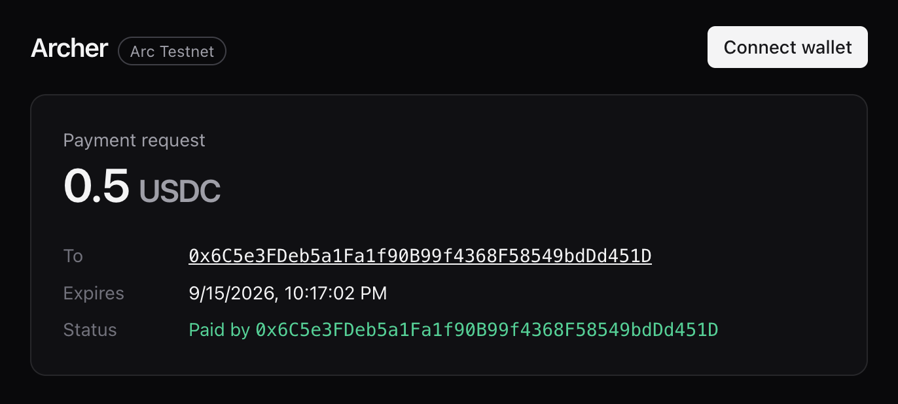

# Archer

[](https://github.com/dvictor357/archer/actions/workflows/ci.yml)

**Aim. Release. Settled.** — Payment request links settled in USDC on [Arc](https://arc.network).

<p align="center">
  
</p>

**Try it:** https://archer-bay.vercel.app (Arc testnet — get USDC at [faucet.circle.com](https://faucet.circle.com))

**Live on Arc testnet:** router [`0x509cF81f15450D908A88b3FC25F61641F42A4AB3`](https://testnet.arcscan.app/address/0x509cF81f15450D908A88b3FC25F61641F42A4AB3) (source verified) ·
proof tx [`0x5e73…3ef`](https://testnet.arcscan.app/tx/0x5e7316d6b79bc5fe2721e64ec47e429c1d4f9090152bec42286604e37f0de3ef) (payer signed, relayer paid gas, `Paid` emitted with `payer = signer`).

A payee creates a request (amount, expiry, memo) and shares a link. The payer settles it in
one transaction. Funds are forwarded to the payee immediately and a `Paid` event fires — Arc's
deterministic sub-second finality means a backend can act on that single event without waiting
for confirmations.

## Layout

```
contracts/   Foundry — ArcherRouter.sol + tests + deploy script
web/         Next.js + wagmi/viem — create link, pay page, Paid listener
chains.json  Shared chain config (testnet 5042002 / mainnet 1243). Deployed router addresses live here.
```

## USDC on Arc: one pool, two views

The native gas asset on Arc **is** USDC. Same funds, two interfaces:

| View | Decimals | Used for |
|---|---|---|
| ERC-20 `0x3600000000000000000000000000000000000000` | 6 | balances, display, events, `amount` in ArcherRouter |
| Native (`msg.value`, gas) | 18 | value transfer only |

`ArcherRouter` takes `amount` in the 6-decimal view (`25 USDC = 25_000000`) and requires
`msg.value == amount * 1e12`. Never add the two views together or treat them as separate assets.

## Contracts

```sh
cd contracts
forge test

# one-time: encrypted keystore for the deployer (never a plaintext key)
cast wallet import archer --interactive

forge script script/Deploy.s.sol --rpc-url arc_testnet --account archer --broadcast
```

Fund the deployer from https://faucet.circle.com first.

### ArcherRouter

| Function | Who | Effect |
|---|---|---|
| `createRequest(amount, expiry, memoHash)` | payee | returns deterministic `id = keccak256(payee, nonce)` |
| `pay(id)` payable | anyone | `msg.value == toNative(amount)`, forwards to payee, emits `Paid` |
| `payWithAuthorization(id, from, validAfter, validBefore, nonce, v, r, s)` | anyone (relayer) | consumes an EIP-3009 `ReceiveWithAuthorization` signed by `from`, forwards to payee, emits `Paid` with `payer = from` |
| `cancel(id)` | payee | deletes unpaid request |
| `refund(id)` payable | payee | returns exact value to payer, emits `Refunded` |
| `toNative(amount)` | view | 6-dec USDC → 18-dec native wei |

### EIP-3009 path — security model

USDC on Arc implements EIP-3009 (domain `USDC` / `2` / `5042002` / `0x3600…0000`, verified on-chain).
A payer signs a `ReceiveWithAuthorization`; anyone relays it; the relayer pays gas. Two attacks are
closed by construction — see `test/ArcherRouterAuthorization.t.sol` and the fork test for proofs:

| Attack | Defense |
|---|---|
| Front-run: take the signature from the mempool and consume it with a bare USDC call | `receiveWithAuthorization` (not `transferWithAuthorization`): USDC requires `msg.sender == to`, and `to` is the router |
| Replay: consume the signature against a *different* request of equal amount whose payee is the attacker | Router requires `nonce == id`; USDC marks the nonce used. The signature is bound to exactly one request |
| Under-pay: sign a smaller `value` | `value` is read from storage; a signature over any other value fails `ecrecover` |

Fork tests run against the real Arc USDC: `ARC_FORK=1 forge test --match-contract Fork`.
(Foundry cannot execute Arc's native-transfer precompile at `0x1800…0000`, so the fork test mocks it and
asserts on the exact calls USDC makes to it.)

## Web

```sh
cd web
pnpm install
pnpm dev                                  # http://localhost:3000
pnpm listen                               # subscribe to Paid over wss, log JSON
WEBHOOK_URL=http://localhost:4000/hook pnpm listen   # ...and POST each event
pnpm abi                                  # regenerate src/lib/abi.ts after forge build
```

`/api/relay` needs `RELAYER_PRIVATE_KEY` in `web/.env.local` (server-side only, never `NEXT_PUBLIC_`).
Fund that address with a little USDC; it pays gas for relayed payments. The route validates input,
checks the request on-chain, and simulates before broadcasting, so a bad signature never costs gas.
Rate limits (per minute): 5 per IP, 3 per signer, 60 global — in-memory, per instance; add edge
limiting in front for hard guarantees.

```sh
pnpm test                                 # unit tests (node --test)
```

Set `NEXT_PUBLIC_ARC_NETWORK=arcMainnet` to point the whole app at mainnet once `chains.json` has its RPC and router filled in.

## Roadmap

- [x] Router contract + tests
- [x] Deploy testnet: [`0x509cF81f15450D908A88b3FC25F61641F42A4AB3`](https://testnet.arcscan.app/address/0x509cF81f15450D908A88b3FC25F61641F42A4AB3)
- [x] Web: create link / pay page / `Paid` webhook listener (wss)
- [x] EIP-3009 sign-and-relay path (`payWithAuthorization` + `/api/relay`)
- [ ] CCTP (domain 26): pay from another chain
- [ ] `ArcherEscrow` (held funds, conditional release)
- [ ] `ArcherAgent` (x402 — same EIP-3009 primitive, agent-signed)
- [ ] Mainnet day-1 redeploy (16 Sep 2026) — see [docs/MAINNET.md](docs/MAINNET.md)

## License

MIT
